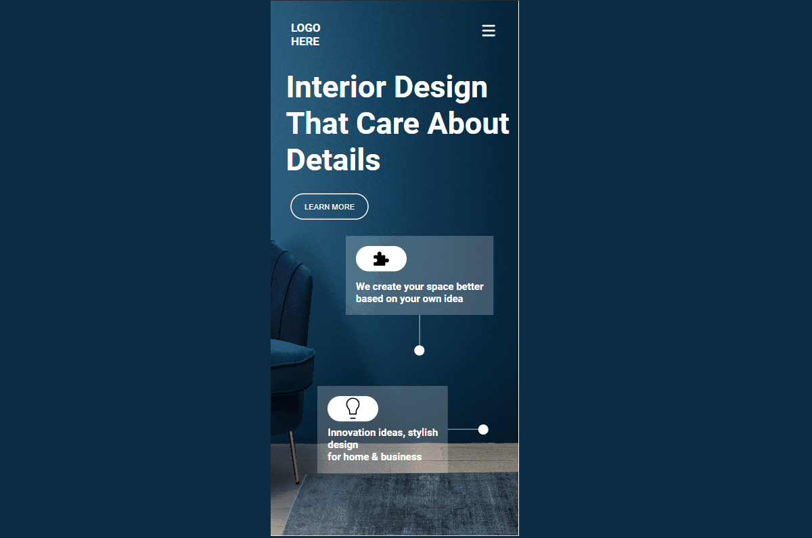

# Interior Design Landing Page

## 🔗 Project Link

>_[View Live Site!](https://interiordesigning.netlify.app/ "Interior Design Landing Page")_

## ⚒️ Tech Stack

&nbsp;
&nbsp;

## 🖼️&nbsp;&nbsp;Screenshots

## 📌 Key Takeaways

    ✔️ Working with background images
    ✔️ Using Flexbox in CSS 
    ✔️ How to position elements on a webpage
    ✔️ Using Media queries to make it responsive
    ✔️ Designing Navbar, Cards, and footer.

> This project took around _**5 hours**_ to complete.
